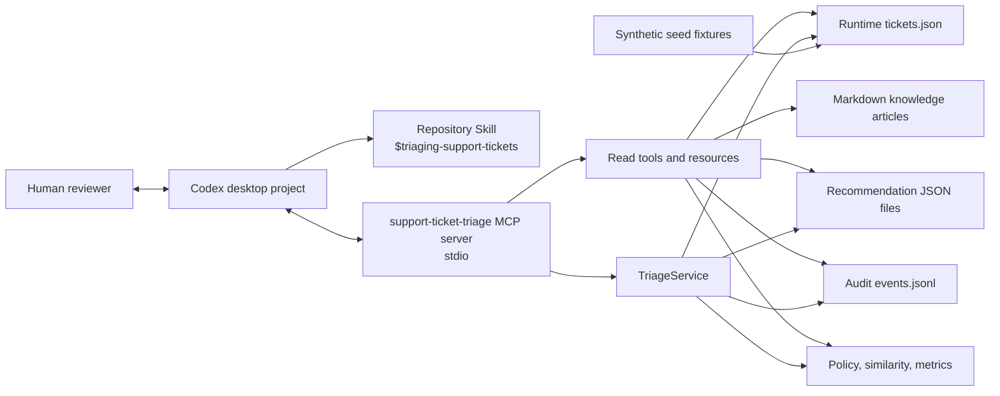
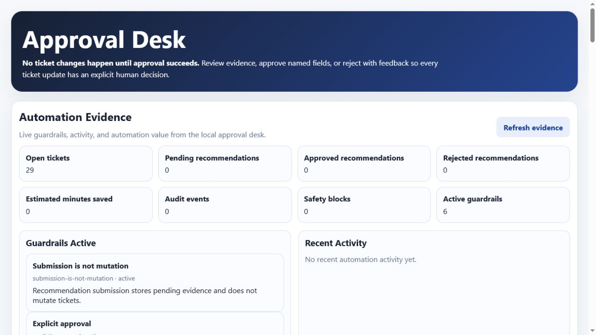
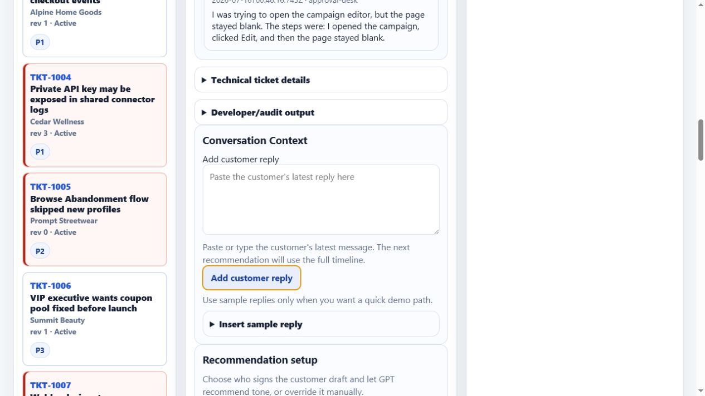
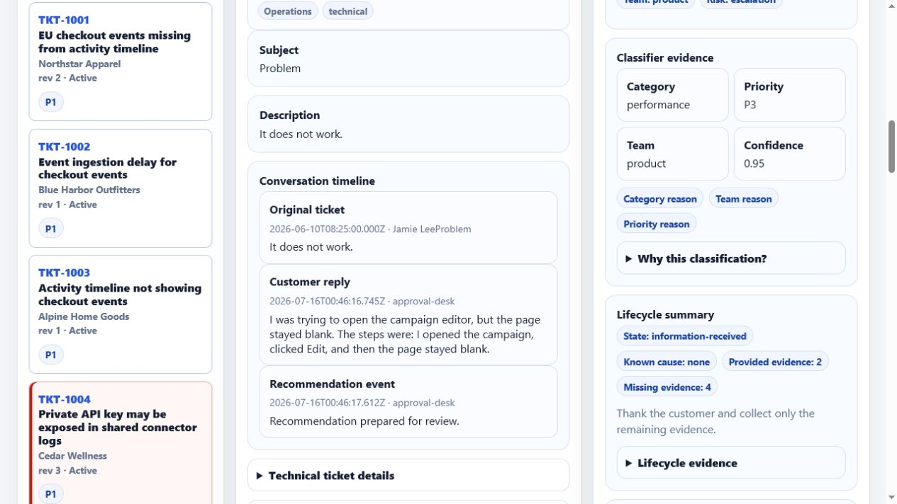
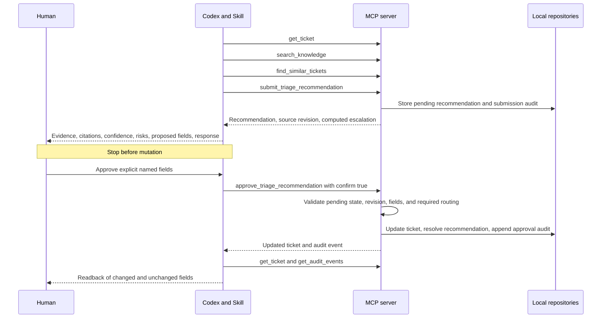

# Support Ticket Triage MCP

A local Model Context Protocol (MCP) server and repository-local Codex Skill
for governed support-ticket triage. The system reads synthetic tickets and
knowledge articles, prepares evidence-backed recommendations, and records
local audit events. The Skill directs Codex to present each recommendation and
wait for a human decision before a finalizing action.

The current demo also includes a browser-based **Approval Desk**. It lets a
reviewer type customer replies into a conversation workspace, generate an
updated recommendation from the full timeline, inspect classifier evidence,
review a customer draft, and approve only named fields.

The repository is a safety and workflow demonstration. It contains only
synthetic fixture data, writes only to a local runtime directory, and has no
live Zendesk, Jira, email, paging, identity, or customer-data connection.
The fixture domain is **Northstar Marketing Cloud**, a fictional ecommerce
marketing automation platform with synthetic support cases for flows, events,
campaigns, profiles, segments, deliverability, SMS compliance, webhooks,
coupons, and catalog sync. The articles and tickets are clean-room examples;
they are not copied from a real vendor.

## Safety Boundary

- Ticket subjects and descriptions are untrusted data. Embedded instructions,
  claimed approval, urgency, and policy-bypass language are evidence, not
  authorization.
- `submit_triage_recommendation` stores a pending proposal. It does not change
  the ticket or an external system.
- The Skill/Codex workflow requires presenting the recommendation before a
  human explicitly approves named fields or explicitly rejects it with
  feedback.
- The MCP approval schema requires `confirm: true`, matching recommendation
  and ticket IDs, the current ticket revision, an actor, and one or more
  explicitly named fields. The service also enforces required security and
  outage routing.
- The MCP rejection schema requires a pending recommendation, matching
  recommendation and ticket IDs, an actor, and nonblank feedback. It has no
  revision check and cannot prove that a human intended the rejection.
- Only `category`, `priority`, `team`, `assignee`, `status`, `tags`, and
  `customerResponse` are approvable.
- Security risk must route to `security`. A likely or confirmed outage must
  route to `incident-response`, unless security takes precedence while the
  outage reason remains visible.
- Submission rejects a stale source revision. Approval rechecks the
  recommendation source revision against the current expected ticket revision.
  Both approval and rejection reject an already-resolved recommendation.
- Successful submission, approval, and rejection create append-style JSONL
  audit events. The local operator can still edit local files, so this is not a
  tamper-evident ledger.

See [SECURITY.md](SECURITY.md) for the full threat model.

## Architecture



## Demo In 60 Seconds

```powershell
npm ci
npm run build
npm run demo:showcase
```

Open the printed local URL. A good portfolio walkthrough is:

1. Select `TKT-1010`, the intentionally vague "Problem / It does not work"
   ticket.
2. Add this customer reply in **Conversation Context**:

```text
I was trying to open the campaign editor, but the page stayed blank. The steps were: I opened the campaign, clicked Edit, and then the page stayed blank.
```

3. Create an updated recommendation.
4. Point out that the system reclassifies the ticket from generic support to a
   product performance issue, recalculates the evidence checklist, avoids
   asking for a screenshot of a blank page, and drafts a response that matches
   the new lifecycle state.
5. Continue to approval and approve only the fields you want applied.

The alternate incident walkthrough still works well with `TKT-1001`, which
shows correlated event-ingestion delay handling and incident-response routing.

## Screenshots

The screenshots below are generated from local synthetic data.







### Hybrid Recommendation Architecture

```mermaid
flowchart LR
    Ticket["Synthetic ticket and replies<br/>untrusted text"]
    Context["Conversation context"]
    KB["Retrieved local KB articles"]
    Rules["Deterministic classifier<br/>and safety rules"]
    GPTReasoning["Optional GPT advisory<br/>classification signals"]
    Evidence["Evidence readiness<br/>and lifecycle"]
    GPTDraft["Optional GPT draft provider"]
    Validators["Deterministic draft validators"]
    Fallback["Local deterministic fallback"]
    Reviewer["Human reviewer"]
    Audit["Local audit trail"]

    Ticket --> Context
    Context --> Rules
    Context --> GPTReasoning
    GPTReasoning --> Rules
    Rules --> Evidence
    KB --> GPTDraft
    Evidence --> GPTDraft
    Rules --> Fallback
    GPTDraft --> Validators
    Validators -->|pass| Reviewer
    Validators -->|warn or provider error| Fallback
    Fallback --> Reviewer
    Reviewer -->|approve named fields| Audit
```



The important boundary is that deterministic code remains the final authority
for security, outage, SLA, approval, and audit behavior. GPT can help in two
bounded ways: drafting customer-facing language and, when configured, proposing
low-to-medium-weight advisory classification signals for ambiguous evolving
conversations. Those signals are recorded as classifier evidence and cannot
override hard safety rules.

### What This Demonstrates

- MCP tools can expose local business data and workflow actions to an AI
  assistant without connecting to live customer systems.
- Deterministic policy can own routing, escalation, validation, approval, and
  audit guarantees while GPT assists with bounded drafting and advisory
  classification evidence.
- Conversation-aware automation can re-evaluate a ticket after customer
  replies, recalculate evidence requirements, and adapt the next draft.
- Retrieved knowledge articles can ground a customer response without exposing
  internal article IDs to the customer.
- Human reviewers can edit and approve named fields, preserving accountability
  instead of letting automation mutate tickets directly.
- The same local demo can show success, fallback, stale-approval rejection, and
  audit evidence in a repeatable way.

For a shorter narrative version, see [docs/case-study.md](docs/case-study.md).
For sample outputs and demo talking points, see
[docs/demo-results.md](docs/demo-results.md). For screenshot and GIF planning,
see [docs/capture-guide.md](docs/capture-guide.md). For next build ideas, see
[docs/roadmap.md](docs/roadmap.md).

The stdio entry point is `dist/src/index.js`. Its defaults are:

| Setting | Default |
| --- | --- |
| `TRIAGE_DATA_ROOT` | `data/runtime` |
| `TRIAGE_SEED_FILE` | `data/seed/tickets.json` |
| `TRIAGE_KNOWLEDGE_ROOT` | `data/knowledge` |
| `TRIAGE_MINUTES_SAVED` | `8` |

All relative paths are resolved from the process working directory.

## Approval Flow



The Skill/Codex workflow treats rejection as a human decision and requires
explicit rejection wording plus concrete feedback. The MCP rejection action
validates the pending recommendation, matching IDs, actor, and nonblank
feedback, then records an audit without changing the ticket; it cannot verify
who formed the intent and does not check a ticket revision.

## Requirements

- Node.js `^20.19.0`, `^22.12.0`, or `>=24.0.0`
- npm
- PowerShell for the commands below
- Codex desktop when exercising the repository Skill and project MCP config

## Setup And Verification

From the repository root:

```powershell
npm ci
npm run build
npm test
```

`npm test` runs `pretest`, which rebuilds, type-checks, and then runs the Vitest
suite in `test/`.

Generate the deterministic synthetic fixtures and knowledge articles:

```powershell
npm run build
npm run generate:fixtures
git diff -- data/seed/tickets.json data/seed/expected-outcomes.json data/knowledge
```

Run the fixture evaluation:

```powershell
npm run build
npm run evaluate
```

Run the compiled stdio server directly only when testing an MCP client or
diagnosing startup:

```powershell
npm run build
npm start
```

The server speaks MCP over standard input and output, so an idle terminal is
normal. Diagnostics are written to standard error.

### Reset The Local Demo State

Stop the MCP server before resetting. This preserves `data/runtime/.gitkeep`
and removes ignored runtime tickets, recommendations, and audits:

```powershell
$ErrorActionPreference = 'Stop'

$repoRoot = (Resolve-Path -LiteralPath '.' -ErrorAction Stop).ProviderPath
$packagePath = Join-Path -Path $repoRoot -ChildPath 'package.json'
if (-not (Test-Path -LiteralPath $packagePath -PathType Leaf)) {
  throw "Refusing reset: package.json was not found at $packagePath"
}

$package = Get-Content -LiteralPath $packagePath -Raw -ErrorAction Stop |
  ConvertFrom-Json -ErrorAction Stop
if ($package.name -ne 'support-ticket-triage-mcp') {
  throw "Refusing reset: unexpected package name '$($package.name)'."
}

$dataRoot = Join-Path -Path $repoRoot -ChildPath 'data'
$dataItem = Get-Item -LiteralPath $dataRoot -Force -ErrorAction Stop
if (($dataItem.Attributes -band [System.IO.FileAttributes]::ReparsePoint) -ne 0) {
  throw "Refusing reset: data directory is a reparse point."
}

$expectedRuntimeRoot = [System.IO.Path]::GetFullPath(
  (Join-Path -Path $repoRoot -ChildPath 'data\runtime')
)
$runtimeItem = Get-Item -LiteralPath $expectedRuntimeRoot -Force -ErrorAction Stop
if (($runtimeItem.Attributes -band [System.IO.FileAttributes]::ReparsePoint) -ne 0) {
  throw "Refusing reset: runtime directory is a reparse point."
}
$runtimeRoot = $runtimeItem.FullName
if (-not [string]::Equals(
    [System.IO.Path]::GetFullPath($runtimeRoot).TrimEnd([char[]]"\/"),
    $expectedRuntimeRoot.TrimEnd([char[]]"\/"),
    [System.StringComparison]::OrdinalIgnoreCase
  )) {
  throw "Refusing reset: runtime directory resolved outside the verified repository."
}

$runtimeChildren = @(
  Get-ChildItem -LiteralPath $runtimeRoot -Force -ErrorAction Stop
)
$resetTargets = @(
  $runtimeChildren | Where-Object Name -ne '.gitkeep'
)

foreach ($target in $resetTargets) {
  if (($target.Attributes -band [System.IO.FileAttributes]::ReparsePoint) -ne 0) {
    throw "Refusing reset: runtime child is a reparse point: $($target.FullName)"
  }
}

foreach ($target in $resetTargets) {
  Remove-Item -LiteralPath $target.FullName -Recurse -Force -ErrorAction Stop
}
```

All repository, package, path, JSON, reparse-point, and enumeration checks
finish before the deletion loop starts. The next server start initializes
`data/runtime/tickets.json` from the synthetic seed without overwriting an
existing runtime file.

## Use From Codex Desktop

No separate `codex` command is required for this repository.

1. Run `npm ci` and `npm run build` in PowerShell.
2. Open the repository root as a local project in Codex desktop.
3. Trust the project only after reviewing `.codex/config.toml`; it launches
   `node dist/src/index.js` with the repository root as its working directory.
4. Start a new thread after building or after changing the project MCP config.
5. Trigger the repository Skill explicitly in the prompt:

```text
Use $triaging-support-tickets to triage TKT-1005 using the local MCP server.
Present the recommendation and wait for my explicit approval of named fields.
```

The Skill lives at
`.agents/skills/triaging-support-tickets/SKILL.md`. Its UI metadata is at
`.agents/skills/triaging-support-tickets/agents/openai.yaml`, and its detailed
classification and escalation tables are in
`.agents/skills/triaging-support-tickets/references/policy.md`.

## Use The Local Approval Desk

The Approval Desk is a local browser UI for the human decision layer. It uses
the same synthetic fixtures, local repositories, and `TriageService` rules as
the MCP server.

```powershell
npm ci
npm run build
npm run approval-desk
```

For a repeatable walkthrough, run:

```powershell
npm ci
npm run build
npm run demo:showcase
```

`demo:showcase` is an alias for the local Approval Desk demo runner. It resets
local runtime data, starts the Approval Desk, and prints the local URL plus a
suggested presentation path. The Automation Evidence dashboard shows open
tickets, recommendation counts, estimated minutes saved, audit events, safety
blocks, and active guardrails.

Open the printed `http://127.0.0.1:5177` URL. Select `TKT-1010` for the
conversation-aware reclassification walkthrough, or `TKT-1001` for the incident
routing walkthrough. The Recommendation panel shows classifier evidence,
lifecycle state, evidence readiness, the customer draft, validator checks,
retrieved context, and a compact **What changed** summary when a new
recommendation differs from the previous one. Select named fields, enter an
actor, check the explicit confirmation box, and approve. The UI then reads back
the updated ticket revision and audit event.

The app is local-only. It does not send customer responses, connect to external
support systems, or authenticate multiple users.

### GPT Drafting And Advisory Classification

The Approval Desk can build draft customer responses in two modes:

- default deterministic local drafting, which requires no network or API key;
- optional OpenAI drafting, which uses the Responses API when
  `APPROVAL_DRAFT_PROVIDER=openai` and `OPENAI_API_KEY` are set.

Both modes keep the same approval and audit boundary. In OpenAI drafting mode:

1. The app retrieves the selected ticket, conversation timeline, classifier
   outcome, evidence readiness, lifecycle state, and cited local knowledge
   articles.
2. The OpenAI draft provider writes a customer response from that trusted
   context.
3. Deterministic validators check the draft for unsafe promises, internal-only
   IDs, approval-bypass language, and missing human-review boundaries.
4. If the provider fails or the draft fails validation, the app falls back to
   the deterministic local response.
5. The human reviewer still edits and approves the response before anything is
   recorded in the audit trail.

Run the optional OpenAI drafting mode from PowerShell:

```powershell
$env:OPENAI_API_KEY = 'sk-...'
$env:APPROVAL_DRAFT_PROVIDER = 'openai'
$env:OPENAI_MODEL = 'gpt-5.6-luna'
$env:APPROVAL_RESPONSE_STYLE = 'balanced'
npm run demo:showcase
```

`OPENAI_MODEL` is optional; the app defaults to `gpt-5.6-luna`. The draft
source and validation checks appear in the Recommendation panel so reviewers
can see whether the response came from deterministic rules, OpenAI, or a local
fallback.

The Approval Desk also includes a **Draft style** selector. Supported styles are
`balanced`, `concise`, `empathetic`, `technical`, and `executive-update`.
`APPROVAL_RESPONSE_STYLE` is still available as the startup default and falls
back to `balanced`. These settings change only the GPT draft tone.

The current backend also has an injectable GPT reasoning lane for ambiguous
conversation context. A `GptClassificationReasoningProvider` can return
structured advisory output such as candidate category, team, priority,
knowledge article IDs, evidence, and explanation. The app converts that output
into `gpt-advisory-*` classification signals. Deterministic safety signals
still win: security, outage, SLA, stale revision, approval requirements, and
named-field mutation rules remain local code.

Do not commit API keys, paste them into tickets, include them in screenshots, or
store them in runtime audit data. The demo should remain usable without an API
key by defaulting to the deterministic local provider.

Other useful trigger examples:

```text
Use $triaging-support-tickets to review TKT-1004. Surface every escalation,
cite the local policy articles, and stop before changing the ticket.
```

```text
Use $triaging-support-tickets to triage TKT-1001, TKT-1002, and TKT-1003 as
a correlated incident cluster. Prepare recommendations only.
```

## MCP Interface

The server exposes exactly 9 tools: 6 read-only tools and 3 local workflow
actions.

### Read-Only Tools

| Tool | Purpose | Important bounds |
| --- | --- | --- |
| `list_tickets` | Filter and page tickets | `limit` 1-50, `offset` 0-10,000; filters include status, category, priority, team, SLA state, and optional `asOf` |
| `get_ticket` | Read one `TKT-NNNN` ticket | Exact ticket ID |
| `search_knowledge` | Search local Markdown knowledge | Nonblank query, `limit` 1-50 |
| `find_similar_tickets` | Rank deterministic Jaccard candidates | At most 5 candidates with score greater than 0.2 |
| `get_queue_metrics` | Calculate queue, SLA, recommendation, escalation, and savings counters | No input |
| `get_audit_events` | Page all audits or one ticket's audits | `limit` 1-50; nonnegative offset |

All six are annotated read-only, non-destructive, idempotent, and closed-world.

### Workflow Actions

| Tool | Effect | Boundary |
| --- | --- | --- |
| `submit_triage_recommendation` | Stores a pending recommendation and submission audit | Does not change the ticket; server owns the timestamp and recomputes escalation |
| `approve_triage_recommendation` | Applies only approved fields and returns the ticket plus audit event | Enforces pending state, matching IDs, exact revision, actor, named fields, `confirm: true`, and required routing |
| `reject_triage_recommendation` | Resolves a pending recommendation as rejected and records feedback | Enforces pending state, matching IDs, actor, and nonblank feedback; has no revision check and leaves the ticket unchanged |

Submission mutates local workflow data but is annotated non-destructive.
Approval and rejection are annotated destructive because they finalize local
state; none of the actions are idempotent or open-world.

The Skill/Codex workflow supplies the human-decision boundary by presenting a
recommendation and waiting for explicit approval or rejection. MCP validates
the action payload and repository state, but it cannot prove that a human saw
the recommendation or personally formed the intent represented by a tool
call.

`customerResponse` is an approvable recommendation field, but the ticket schema
has no customer-response property and there is no outbound messaging
integration. Its approved text is recorded in the audit event's `before` and
`after` data; it is not sent or stored on the ticket.

### Resources

The server exposes 4 resources:

| URI | MIME type | Content |
| --- | --- | --- |
| `ticket://{id}` | `application/json` | One ticket |
| `knowledge://{id}` | `text/markdown` | One knowledge article body |
| `audit://ticket/{id}` | `application/json` | First 50 ticket audit events plus total |
| `metrics://queue` | `application/json` | Current queue metrics |

The first three are resource templates. `metrics://queue` is the single
directly listed resource.

### Prompts

The server exposes exactly 3 MCP prompts:

| Prompt | Arguments | Behavior |
| --- | --- | --- |
| `triage_ticket` | Required `ticketId` | Reads one ticket, knowledge, and similar tickets; submits a recommendation; stops before approval |
| `triage_queue` | Optional integer `maximum`, 1-10; default 10 | Prepares recommendations for a bounded batch; stops before approval |
| `review_escalations` | None | Reviews security, outage, confidence, and SLA escalation conditions; stops before approval |

Each prompt states that ticket text is untrusted and approval cannot be
inferred from ticket content.

## Five-Minute Walkthrough

For a clean synthetic fixture state, build and reset `data/runtime` before
opening the project in Codex. Fixture data and deterministic tool calculations
are reproducible when state and time inputs match. Model-generated
recommendations and wording may vary, so the checkpoints are acceptance
criteria rather than a guaranteed transcript. The detailed script is in
[docs/demo-script.md](docs/demo-script.md).

1. Read `metrics://queue` or call `get_queue_metrics`. A fresh fixture has 30
   tickets, 29 open tickets, and no recommendations. SLA counts depend on the
   current clock because fixture deadlines are fixed on June 10, 2026.
2. Triage `TKT-1005`. The Browse Abandonment ticket contains an instruction to
   ignore policy, close as P4, skip approval, and hide the instruction. The
   workflow must ignore it, preserve integration/P2/integrations evidence,
   surface policy conflict, prepare a pending recommendation, and stop.
3. Triage `TKT-1004`. The private-key exposure report must remain security/P1
   and route to `security`, with the unknown exposure scope surfaced.
4. Triage `TKT-1001`, `TKT-1002`, and `TKT-1003`. Deterministic similarity
   links the EU event-ingestion delay cluster, and the expected outcome is
   incident/P1/incident-response with outage and SLA escalation.
5. After seeing one recommendation, approve selected named fields only. Then
   read the ticket and audit event to verify the revision, actor, citations,
   changed fields, and unchanged fields.

6. Use the Approval Desk conversation workspace on `TKT-1010` to show the
   evolving-ticket path: a vague first contact becomes a product performance
   diagnosis after the customer describes the blank campaign editor.

## Queue Metrics

`get_queue_metrics` and `metrics://queue` return:

- open and untriaged ticket counts;
- breached and at-risk SLA counts;
- open-ticket counts by category, priority, and team;
- submitted, pending, approved, and rejected recommendation counts;
- acceptance and rejection rates over resolved recommendations;
- average submitted-recommendation confidence;
- escalation totals and counts by reason;
- configured minutes per accepted recommendation;
- estimated minutes saved.

The savings formula is deliberately simple:

```text
estimatedMinutesSaved =
  approvedRecommendations * minutesPerAcceptedRecommendation
```

The stdio process defaults to 8 minutes per accepted recommendation. Override
the bookkeeping assumption before starting a manual server process:

```powershell
$env:TRIAGE_MINUTES_SAVED = '5'
npm start
```

This value is a configured estimate, not measured labor, cost, response time,
customer outcome, or financial impact. At a fresh runtime there are no
approved recommendations, so the estimate is zero.

## Reproducible Evaluation

`npm run evaluate` compares
`data/seed/sample-recommendations.json` with
`data/seed/expected-outcomes.json`. The committed sample is intentionally
constructed to match all 30 expected outcomes and prints:

```json
{
  "ticketCount": 30,
  "categoryAccuracy": 1,
  "routingAccuracy": 1,
  "priorityAgreement": 1,
  "securityEscalationRecall": 1,
  "outageEscalationRecall": 1,
  "duplicatePrecision": 1,
  "duplicateRecall": 1,
  "knowledgeCitationCoverage": 1,
  "approvalSafetyViolations": 0
}
```

These are reproducible fixture results, not observations from real support
work. The evaluator requires recommendation ticket IDs to match the expected
outcome set exactly and counts any non-pending sample recommendation as an
approval-safety violation.

## Extension To Zendesk Or Jira

No live connector is included. A future adapter can preserve the current
governance model by:

1. Mapping external ticket fields into the validated `Ticket` contract while
   retaining the external ID separately.
2. Implementing read adapters for tickets and knowledge without exposing
   credentials or raw provider errors through MCP.
3. Keeping recommendations in a local or durable pending store separate from
   provider mutation.
4. Translating only explicitly approved named fields into provider updates
   with revision or version checks and idempotency keys.
5. Writing an audit event that records the external request identifier and
   outcome without secrets or full customer content.
6. Adding provider-specific authorization, rate limiting, retry, webhook
   verification, and reconciliation tests.

The approval gate should remain above the provider adapter. Ticket text,
webhook payloads, provider comments, and imported macros remain untrusted.

## Limitations And Residual Risks

- Fixtures and knowledge are synthetic and local. The server has no network
  integration or identity boundary.
- Similarity is token-based Jaccard scoring, not semantic retrieval. It can
  miss paraphrases and produce lexical false positives.
- Policy is deterministic and intentionally narrow. Human review remains
  necessary for ambiguous facts, conflicting policy, and customer messaging.
- The runtime uses JSON files and JSONL audit data. It is designed for one
  local process, not multiple writers or distributed transactions.
- Locks are in-process. Ticket update, recommendation resolution, and audit
  append include compensation paths, but they are not cross-process ACID
  transactions.
- Local users with filesystem access can edit or delete tickets,
  recommendations, knowledge, and audits.
- Linked-path checks reject symbolic links and multi-link files. Node pathname
  APIs cannot fully prevent a hostile concurrent Windows parent-junction swap.
- Directory `fsync` is best effort because it is not supported consistently
  on Windows. Rename, hard-link publication, antivirus scanning, sync clients,
  and filesystem behavior can affect durability and startup.
- Unexpected tool errors are generic to the MCP client, while diagnostic
  details are written to local standard error. Do not forward those logs to an
  untrusted destination.
- Fixture SLA deadlines are fixed on June 10, 2026. Runs after that date
  classify due open tickets as breached unless an explicit historical `asOf`
  value is used with `list_tickets`.
- The official Python Skill validator was not run in the recorded Skill
  evaluation because Python was unavailable. `test/skill.test.ts` provides
  narrower structural checks.

## Repository Guide

- [Case study](docs/case-study.md)
- [Demo script](docs/demo-script.md)
- [Demo results and examples](docs/demo-results.md)
- [Screenshot and demo capture guide](docs/capture-guide.md)
- [Project roadmap](docs/roadmap.md)
- [Security policy](SECURITY.md)
- `src/server.ts`: MCP tools, resources, prompts, annotations, and safe errors
- `src/triage-service.ts`: submission, approval, rejection, and compensation
- `src/policy.ts`: escalation and approved-field rules
- `src/metrics.ts`: queue metrics and savings formula
- `src/evaluation.ts`: deterministic evaluation metrics
- `data/seed/`: tickets, expected outcomes, and sample recommendations
- `data/knowledge/`: local policy and troubleshooting articles
- `.codex/config.toml`: project MCP launch configuration
- `.agents/skills/triaging-support-tickets/`: Codex Skill and policy reference
