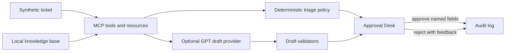

# Case Study: Governed AI Support Triage

## Summary

This project demonstrates a local AI automation workflow for B2B SaaS support
triage. It combines a Model Context Protocol server, deterministic policy
checks, retrieved local knowledge, optional GPT customer-response drafting,
human approval, and append-style audit events.

The fictional domain is **Northstar Marketing Cloud**, an ecommerce marketing
automation platform with synthetic support tickets for events, flows,
deliverability, SMS compliance, webhooks, segments, profiles, coupons, and
catalog sync.

## Problem

Support teams often need to classify tickets, route work, ask customers for the
right evidence, and keep audit trails without allowing untrusted customer text
to drive automation directly.

The risky version of this workflow would let a model read a ticket and mutate a
support system immediately. This project shows a safer architecture:

- ticket text is treated as untrusted evidence;
- deterministic policy owns routing and escalation;
- GPT drafts only customer-facing wording from trusted context;
- validators check the draft before review;
- a human explicitly approves named fields;
- every state transition is recorded locally.

## Architecture



The key design choice is separation of responsibilities. The model may help
write, but it does not own authorization, escalation, mutation, or audit.

## Demo Scenario

The main browser demo uses `TKT-1001`, an EU Checkout Started event delay
incident.

1. The user runs `npm run demo:showcase`.
2. The Approval Desk resets local runtime state and opens a local URL.
3. The reviewer selects `TKT-1001` and chooses a draft style.
4. The system retrieves local knowledge articles and creates a pending
   recommendation.
5. The Recommendation panel shows:
   - draft customer response;
   - recommended category, priority, and team;
   - draft source and style;
   - validator checks;
   - retrieved context;
   - human approval status.
6. The reviewer edits or approves selected fields.
7. The service applies only approved fields and records an audit event.

## Safety Properties

- Prompt-injection text inside tickets is never authorization.
- Recommendation submission does not mutate the ticket.
- Approval requires exact ticket revision, actor, named fields, and
  `confirm: true`.
- Security and outage routing are enforced by deterministic code.
- GPT drafting falls back to local deterministic text if provider calls fail or
  validator checks warn.
- Customer responses are recorded in audit data only; the demo has no outbound
  messaging integration.

## Evidence

The committed fixture evaluator reports:

```json
{
  "ticketCount": 30,
  "categoryAccuracy": 1,
  "routingAccuracy": 1,
  "priorityAgreement": 1,
  "securityEscalationRecall": 1,
  "outageEscalationRecall": 1,
  "duplicatePrecision": 1,
  "duplicateRecall": 1,
  "knowledgeCitationCoverage": 1,
  "approvalSafetyViolations": 0
}
```

These metrics are reproducible fixture checks, not real customer support
performance claims.

## What To Review In The Code

- `src/server.ts`: MCP tools, resources, prompts, and safety annotations.
- `src/triage-service.ts`: submission, approval, rejection, and audit logic.
- `src/approval-desk/draft-response-provider.ts`: GPT drafting, structured
  output parsing, validator fallback, and safe error handling.
- `src/approval-desk/http.ts`: local Approval Desk API.
- `src/approval-desk/ui.ts`: browser review and approval interface.
- `data/knowledge/`: local clean-room knowledge articles.

