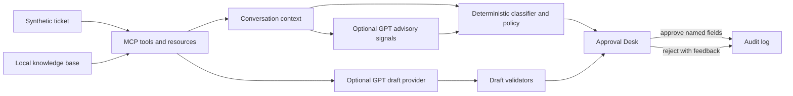

# Case Study: Governed AI Support Triage

## Summary

This project demonstrates a local AI automation workflow for B2B SaaS support
triage. It combines a Model Context Protocol server, deterministic policy
checks, conversation-aware classification, retrieved local knowledge, optional
GPT customer-response drafting, bounded GPT advisory classification signals,
human approval, and append-style audit events.

The fictional domain is **Northstar Marketing Cloud**, an ecommerce marketing
automation platform with synthetic support tickets for events, flows,
deliverability, SMS compliance, webhooks, segments, profiles, coupons, and
catalog sync.

## Problem

Support teams often need to classify tickets, route work, ask customers for the
right evidence, and keep audit trails without allowing untrusted customer text
to drive automation directly.

The risky version of this workflow would let a model read a ticket and mutate a
support system immediately. This project shows a safer architecture:

- ticket text is treated as untrusted evidence;
- deterministic policy owns safety-critical routing and escalation;
- GPT can draft customer-facing wording from trusted context;
- GPT can optionally propose auditable advisory classification signals for
  ambiguous follow-up replies, while deterministic safety rules remain final;
- validators check the draft before review;
- a human explicitly approves named fields;
- every state transition is recorded locally.

## Architecture


```mermaid
flowchart LR
    Ticket["Synthetic ticket"]
    KB["Local knowledge base"]
    MCP["MCP tools and resources"]
    Context["Conversation context"]
    Rules["Deterministic classifier and policy"]
    GPTSignals["Optional GPT advisory signals"]
    GPT["Optional GPT draft provider"]
    Checks["Draft validators"]
    Desk["Approval Desk"]
    Audit["Audit log"]

    Ticket --> MCP
    KB --> MCP
    MCP --> Context
    Context --> Rules
    Context --> GPTSignals
    GPTSignals --> Rules
    Rules --> Desk
    MCP --> GPT
    GPT --> Checks
    Checks --> Desk
    Desk -->|approve named fields| Audit
    Desk -->|reject with feedback| Audit
```

The key design choice is separation of responsibilities. The model may help
interpret messy customer language and write the response, but it does not own
authorization, hard safety escalation, mutation, or audit.

The system has a second, deliberately subordinate learning plane. The
**operational plane remains authoritative** for ticket state, evidence gates,
diagnosis, fixes, verification, lifecycle transitions, and customer drafts.
After an operator-approved diagnosis reaches a governed fix and a customer-
confirmed or technically verified outcome, the learning plane records a
sanitized event in the SQLite learning ledger. Deterministic discovery can then
propose a candidate knowledge object; optional GPT drafting only fills
reviewable parameters, and an authorized operator must promote an immutable
version before it can influence a future evaluation.

Learning maturity is explicit (`observed`, `diagnosis-supported`,
`outcome-verified`, `reuse-validated`, `promoted`) and separate from health
(`active`, `stale`, `contradicted`, `deprecated`, `superseded`). Historical
recommendations and versions are never rewritten. A stale object remains
queryable with decayed recurrence weight, but never bypasses evidence gates.
This is a human-governed learning loop, not autonomous model retraining.

The operational plane is now durable SQLite rather than a collection of
mutable JSON/JSONL files. A domain command writes its projection/revision,
causal event, safe trace, immutable replay result, and any learning-outbox
intent in one transaction. `BEGIN IMMEDIATE` serializes local writers while
the domain revision and watermark checks reject stale work. A command retry
after process restart returns its original semantic envelope instead of
rebuilding a result from newer state.

Migration is explicit and observable: `empty` and `import-in-progress` allow
inspection/import only; `imported` and `native` allow normal mutations. Legacy
append order becomes ticket-local causal sequence order, and timestamps remain
descriptive. The read-only Decision Timeline starts from that event spine and
joins messages, recommendations, diagnoses, revisions, and safe traces through
their committed event IDs. Customer bodies stay in Conversation Context.

Operational success does not depend on advisory learning availability. The
same transaction records a frozen outbox envelope, then a separate worker
delivers it to `learning.sqlite` under a stable delivery key. Retryable failure
leaves it pending; non-retryable failure is dead-lettered; neither outcome
invalidates the already committed support workflow.

## Demo Scenario

The fastest browser demo uses `TKT-1010`, a deliberately vague ticket that
becomes classifiable after a customer reply. `TKT-1001` remains a strong
alternate incident demo for EU Checkout Started event delays.

1. The user runs `npm run demo:showcase`.
2. The Approval Desk resets local runtime state and opens a local URL.
3. The reviewer selects `TKT-1010`, adds a customer reply describing the blank
   campaign editor, and creates an updated recommendation.
4. The system re-evaluates the full conversation, recalculates evidence
   requirements, retrieves local knowledge articles, and creates a pending
   recommendation.
5. The Recommendation panel shows:
   - draft customer response;
   - recommended category, priority, and team;
   - classifier evidence and lifecycle state;
   - a "What changed" summary when recommendation history exists;
   - draft source and style;
   - validator checks;
   - retrieved context;
   - human approval status.
6. The reviewer edits or approves selected fields.
7. The service applies only approved fields and records an audit event.

## Chronological Lifecycle Slice

The browser walkthrough is complemented by a deterministic, stateful MCP
replay. It does not mock the diagnostic engine or skip the approval boundary:

```powershell
npm run evaluate:lifecycle-replay
```

The replay follows the backend guidance through evidence collection, diagnosis,
explicit diagnosis/response approval, a customer reply, mitigation/fix,
verification, and closure. It reads `get_ticket_workflow` before every
mutation and checks that each read carries the accumulated conversation,
recommendation history, evidence-aware latest recommendation, and operator
blockers/approval fields. The resulting journey ends in `resolved` only after
the governed close action.

The second example is intentionally different: the bounded ambiguity scenario
remains evidence-aware and escalates to specialist review when the available
replies do not distinguish the remaining hypotheses. It is not treated as a
successful diagnosis merely because the ticket has complete checklist fields.

This split makes the authority boundary visible: the diagnostic matrix tests
many families without mutation, while the replay proves chronological state
transitions using the production service and MCP path.

## Durable learning showcase

Run the local showcase with:

```powershell
npm run demo:learning-ledger
```

It uses a temporary SQLite database and controlled providers. The report shows
deterministic candidate discovery, explicit support-lead promotion, a verified
outcome, later successful reuse, a failed reuse signal, stale decay, and a
byte-for-byte unchanged pre-promotion recommendation. The demo is intentionally
bounded: it proves governed knowledge evolution and reusable evidence, not
autonomous retraining or automatic production policy changes.

## Operational restart showcase

```powershell
npm run demo:operational-persistence
```

This controlled run imports a typed legacy aggregate containing evaluation,
approval, diagnosis, fix, verification, and closure milestones, inspects its
safe causal Decision Timeline, closes both SQLite handles, and proves an
identical reload. It reports advisory learning separately so the portfolio
demonstrates the authority boundary rather than implying that learned context
is ticket truth.

## Safety Properties

- Prompt-injection text inside tickets is never authorization.
- Recommendation submission does not mutate the ticket.
- Approval requires exact ticket revision, actor, named fields, and
  `confirm: true`.
- Security and outage routing are enforced by deterministic code.
- GPT advisory classification signals are bounded, visible, and cannot
  override deterministic security, outage, SLA, or approval rules.
- GPT drafting falls back to local deterministic text if provider calls fail or
  validator checks warn.
- Customer responses are recorded in audit data only; the demo has no outbound
  messaging integration.

## Evidence

The committed fixture evaluator reports:

```json
{
  "ticketCount": 30,
  "categoryAccuracy": 1,
  "routingAccuracy": 1,
  "priorityAgreement": 1,
  "securityEscalationRecall": 1,
  "outageEscalationRecall": 1,
  "duplicatePrecision": 1,
  "duplicateRecall": 1,
  "knowledgeCitationCoverage": 1,
  "approvalSafetyViolations": 0
}
```

These metrics are reproducible fixture checks, not real customer support
performance claims.

## Queue Metrics And Confidence Semantics

The project also exposes one queue-metrics contract through the Approval Desk,
`/api/metrics`, MCP `get_queue_metrics`, `metrics://queue`, and the deterministic
`npm run demo:metrics` showcase. The shared `QueueMetricsSchema` keeps those
surfaces aligned instead of maintaining separate counters.

Classifier confidence is uncertainty-aware decision support, not calibrated
probability. The `uncertainty-aware-v1` method combines support, runner-up
margin, independent signal diversity, and disagreement penalties. Low,
medium, and high bands are `<0.75`, `0.75–<0.90`, and `>=0.90`; bounded reason
codes make uncertainty inspectable while staying out of customer responses.
GPT may propose advisory classification signals, but deterministic routing and
trusted provenance remain authoritative.

Savings are deliberately labelled as estimates. `estimatedMinutesSaved` counts
approved recommendations under the configured minutes-per-approval assumption;
`potentialMinutesSaved` projects pending work. Neither is measured stopwatch
time, labor cost, customer outcome, or financial impact.

## What To Review In The Code

- `src/server.ts`: MCP tools, resources, prompts, and safety annotations.
- `src/triage-service.ts`: submission, approval, rejection, and audit logic.
- `src/approval-desk/draft-response-provider.ts`: GPT drafting, structured
  output parsing, advisory reasoning contracts, validator fallback, and safe
  error handling.
- `src/approval-desk/classifier.ts`: deterministic classification, weighted
  signals, metadata handling, safety precedence, and GPT advisory signal
  resolution.
- `src/approval-desk/conversation-context.ts`: normalized ticket and reply
  context for reclassification.
- `src/approval-desk/http.ts`: local Approval Desk API.
- `src/approval-desk/ui.ts`: browser review and approval interface.
- `data/knowledge/`: local clean-room knowledge articles.

