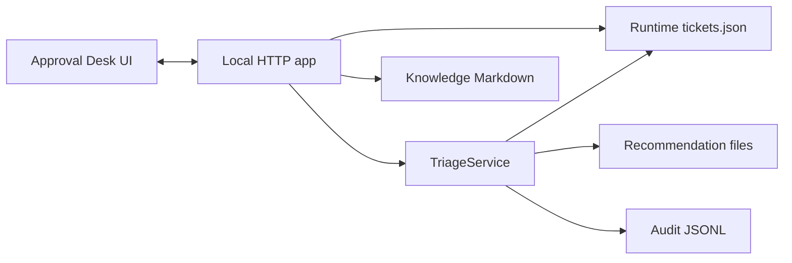

# Approval Desk Design

## Goal

Add a local Approval Desk web UI that demonstrates the human-in-the-loop side
of the support-ticket triage workflow. The UI makes the approval boundary
visible: the system can prepare a recommendation, but a human must review the
evidence and approve named fields or reject with feedback before local ticket
state changes.

The feature should strengthen the existing MCP and Skill demo, not replace it.
It reuses the same synthetic tickets, knowledge articles, recommendation store,
audit store, and `TriageService` rules already used by the MCP server.

## User Experience

The Approval Desk opens in a browser as a local-only demo app. A reviewer can:

1. pick or load a ticket from the synthetic queue;
2. inspect the ticket summary, including suspicious or policy-bypass text;
3. generate or load a pending recommendation;
4. review proposed fields, confidence, rationale, citations, escalation
   reasons, duplicate candidates, and draft customer response;
5. approve only selected named fields with an actor name and explicit
   confirmation;
6. reject the recommendation with required feedback;
7. see the updated ticket revision and audit event after the action.

The UI must state clearly that submission is not approval and that no ticket
fields are changed until approval succeeds.

## Scope

In scope:

- local HTTP server command, for example `npm run approval-desk`;
- plain HTML, CSS, and browser JavaScript served by the local app;
- API endpoints that wrap existing repositories and `TriageService`;
- ticket list, ticket detail, recommendation display, approval, rejection, and
  audit readback;
- tests for endpoint behavior and approval/rejection safety;
- README and demo-script updates.

Out of scope:

- production authentication, multi-user sessions, or hosted deployment;
- real Zendesk, Jira, email, paging, or customer-data integrations;
- replacing the MCP server or changing the repository Skill contract;
- sending customer responses externally.

## Architecture

Add a small local HTTP app beside the MCP server. The HTTP app builds the same
core dependencies as `src/index.ts`: `TicketRepository`, `KnowledgeRepository`,
`RecommendationRepository`, `AuditRepository`, and `TriageService`.

The browser talks to this app through JSON endpoints. The app performs no
business-rule shortcuts; all state-changing operations go through
`TriageService.submit`, `TriageService.approve`, or `TriageService.reject`.

## Components

### Local HTTP App

The server should expose a minimal set of local endpoints:

- `GET /` serves the UI shell;
- `GET /api/tickets` lists tickets with `status`, `category`, `priority`,
  and `team` filters;
- `GET /api/tickets/:id` returns one ticket and its recent audits;
- `POST /api/tickets/:id/recommendations` creates a pending recommendation;
- `GET /api/recommendations/:id` returns one recommendation;
- `POST /api/recommendations/:id/approve` approves selected fields;
- `POST /api/recommendations/:id/reject` rejects with feedback;
- `GET /api/metrics` returns queue metrics.

The first version will use a deterministic recommendation builder derived from
the existing fixture expectations and knowledge IDs. A later version can let
Codex prepare the recommendation through MCP and then open the pending
recommendation in the UI.

### Browser UI

The UI should be simple and readable:

- left column: ticket queue and selected ticket summary;
- main panel: recommendation card and approval controls;
- right or lower panel: audit trail and metrics after the action.

Approval controls should use checkboxes for approvable fields:
`category`, `priority`, `team`, `assignee`, `status`, `tags`, and
`customerResponse`. The approve button is disabled until at least one field,
an actor, and explicit confirmation are present.

Reject controls should require feedback and should not require a ticket
revision, matching the current MCP rejection behavior.

## Data Flow

1. The reviewer loads a ticket.
2. The UI asks the local app to create a recommendation.
3. The local app stores the recommendation and submission audit through
   `TriageService.submit`.
4. The UI displays the recommendation and stops.
5. The reviewer approves selected fields or rejects with feedback.
6. The local app calls the matching `TriageService` finalizer.
7. The UI reads back the ticket and audit events and displays the result.

This makes the real human decision visible in the demo while preserving the
existing server-side enforcement.

## Error Handling

The UI should show domain errors in plain language:

- stale approval: refresh the ticket and recommendation before retrying;
- replayed approval or rejection: explain that the recommendation is already
  resolved;
- invalid selected fields: show which field cannot be approved;
- missing actor, missing feedback, or missing confirmation: keep the button
  disabled and explain the missing requirement;
- unexpected errors: show a generic local-demo failure and keep raw stack traces
  out of the browser.

## Testing

Add focused tests for:

- generating a pending recommendation does not mutate the ticket;
- approval requires actor, `confirm: true`, selected fields, and current
  revision;
- stale approval returns a safe error and does not append a success audit;
- partial approval changes only selected fields;
- rejection requires feedback and does not change ticket fields;
- API responses omit raw stack traces and preserve domain error codes.

Existing MCP and repository tests remain the primary coverage for lower-level
rules. The new tests should prove the UI-facing HTTP layer does not bypass
those rules.

## Documentation

Update the README and demo script with:

- setup command;
- `npm run approval-desk` command;
- browser walkthrough for `TKT-1005`;
- expected approval and rejection checkpoints;
- note that the app is local-only and uses synthetic data.

The docs should position the Approval Desk as the visible human approval layer
above the governed local action service.
